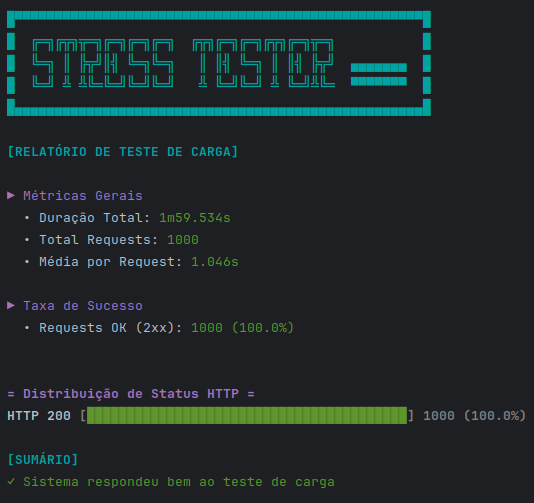
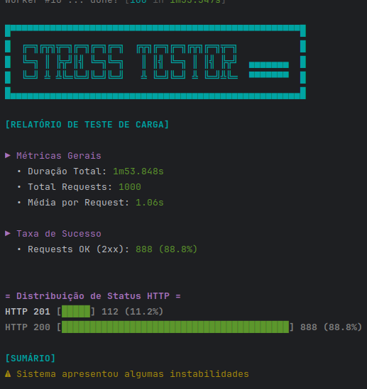
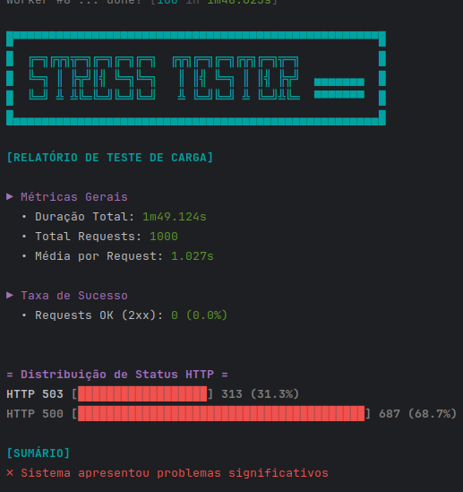
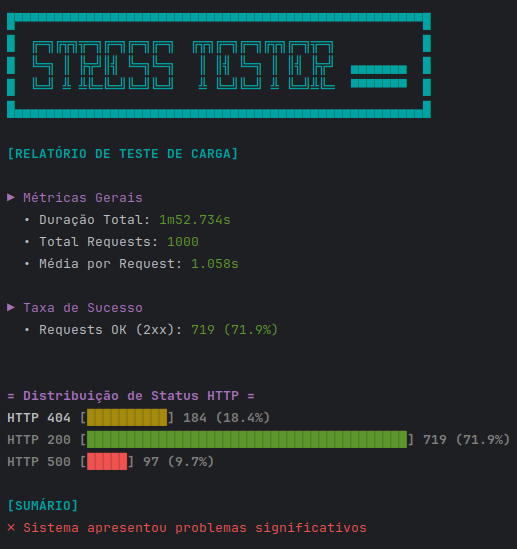
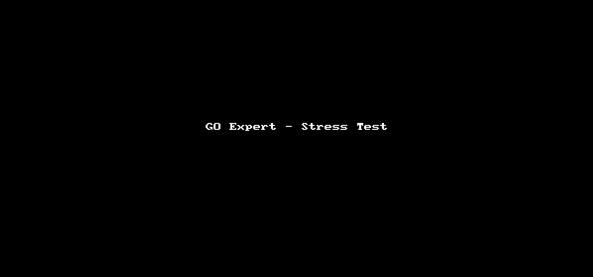

# Stress Tester

Uma ferramentas baseada Go para teste de carga HTTP/HTTPS que permite algumas configurações.

## Sobre o Projeto

Esta suíte de testes inclui dois componentes principais:

### 1. Stress Tester

O Stress Tester é uma ferramenta de teste de carga HTTP que executa requisições concorrentes e gera relatórios 
detalhados de performance, podendo ser utilizado contra qualquer endpoint HTTP/HTTPS.

- Execução concorrente de requisições HTTP
- Controle preciso do número de workers
- Visualização em tempo real do progresso por worker
- Relatório detalhado com métricas e distribuição de status
- Interface visual colorida no terminal

### 2. Random Response Server

O Random Response Server é um componente adicional que simula diferentes códigos de status HTTP e latências variáveis, 
permitindo validar o comportamento do Stress Tester e visualizar resultado do relatório ao término da execução.

- Simulação de endpoints HTTP com comportamento controlado
- Distribuição ponderada de status codes (200, 404, 500, etc.)
- Latência configurável e aleatória
- Auto-desligamento após volume de requisições e ociosidade
- Ideal para testes em ambiente de desenvolvimento

## Características

- Clean Architecture
- Configuração via Docker Compose
- Testes automatizados
- Métricas detalhadas
- Visualização em tempo real

## Tecnologias

- Go 1.23+
- Docker & Docker Compose
- GitHub Actions para CI/CD
- Bibliotecas: go-pretty

## Docker

- `Dockerfile`: Container do cliente de teste
- `Dockerfile.server`: Container do servidor de teste
- `compose.yml`: Orquestração dos serviços

## Ideal Para

- Testes de carga
- Validação de performance
- Simulação de cenários de erro
- Testes de resiliência
- Demonstrações e POCs

---

## Exemplos de Uso

### 1. Docker Compose

O `compose.yml` permite configurar diferentes distribuições de status HTTP para os testes, bastando ajustar a variável STATUS_WEIGHTS do random-server para predefinir o comportamento desejado das respostas: cenários de sucesso, erro ou mistos.

```bash
docker-compose up --build
```

### 2. Docker Container

O Stress Tester pode ser executado isoladamente via Docker para realizar testes de carga em qualquer endpoint HTTP/HTTPS acessível.

```bash
docker run stress-tester --url=https://api.exemplo.com --requests=1000 --concurrency=10
```

### Distribuições de Status HTTP

Esta tabela apresenta três perfis de distribuição de status HTTP configuráveis no random-server, permitindo simular diferentes cenários de resposta para validação do teste de carga.

| Sucesso                              | Instavel                                           | Erro                                            | Misto                                      |
|--------------------------------------|----------------------------------------------------|-------------------------------------------------|--------------------------------------------|
|  |  |  |  |


## Demo

Aqui está uma demonstração de como o comando exibe o resultado da execução do teste de carga quando executado via container Docker de forma isolada:



---

# Licença e Créditos

## Origem do Projeto

Este projeto foi desenvolvido como parte dos desafios propostos no curso MBA Go Expert da Full Cycle, criado e ministrado por Wesley Willians. 

* Testes de carga em Go
* Concorrência e Paralelismo
* Clean Architecture
* Docker e Containerização
* Testes em Go

## Uso e Responsabilidade

Este código é disponibilizado apenas para fins de estudo e referência. Importante notar que:

* Não há garantias de adequação para uso em produção
* Não há suporte técnico ou manutenção ativa
* O uso em ambiente produtivo é de total responsabilidade do usuário
* Recomenda-se fortemente uma revisão completa e testes extensivos antes de qualquer uso em produção

## Agradecimentos

* Wesley Willians e Full Cycle pelo excelente material e desafios propostos
* Comunidade Go Expert pelo compartilhamento de conhecimento e discussões

## Aviso Legal

O CÓDIGO É FORNECIDO "COMO ESTÁ", SEM GARANTIA DE QUALQUER TIPO, EXPRESSA OU IMPLÍCITA, INCLUINDO, MAS NÃO SE LIMITANDO ÀS GARANTIAS DE COMERCIALIZAÇÃO, ADEQUAÇÃO A UM DETERMINADO FIM E NÃO VIOLAÇÃO. EM NENHUM CASO OS AUTORES OU TITULARES DE DIREITOS AUTORAIS SERÃO RESPONSÁVEIS POR QUALQUER RECLAMAÇÃO, DANOS OU OUTRA RESPONSABILIDADE, SEJA EM UMA AÇÃO DE CONTRATO, DELITO OU DE OUTRA FORMA, DECORRENTE DE, OU EM CONEXÃO COM O CÓDIGO OU O USO OU OUTRAS NEGOCIAÇÕES NO CÓDIGO.